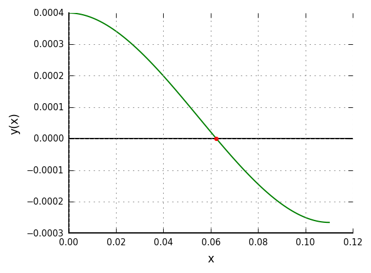

# Gosl. num. Fundamental numerical methods

[](https://pkg.go.dev/github.com/lei006/gomath/num)

This package implements essential numerical methods such as for root finding, numerical quadrature,
numerical differentiation, and solution of simple nonlinear problems.

While the sub-package [num/qpck](https://github.com/lei006/gomath/tree/master/num/qpck) provides
advanced quadrature schemes (by wrapping [Quadpack](http://www.netlib.org/quadpack/)), this package
implements few (simpler) methods to compute numerical integrals. Here, there are two kinds of
algorithms: (1) basic methods for discrete data; and (2) using refinement for integrating general
functions.

## Example: Using Brent's method:

Find the root of

```
    y(x) = x³ - 0.165 x² + 3.993e-4
```

within [0, 0.11]. See figure below. Note: we have to make sure that the root is bounded otherwise Brent's method doesn't work. 



```go
	// y(x) function
	yx := func(x float64) float64 {
		return math.Pow(x, 3.0) - 0.165*math.Pow(x, 2.0) + 3.993e-4
	}

	// range: be sure to enclose root
	xa, xb := 0.0, 0.11

	// initialize solver
	solver := num.NewBrent(yx, nil)

	// solve
	xo := solver.Root(xa, xb)

	// output
	yo := yx(xo)
	io.Pf("x      = %v\n", xo)
	io.Pf("f(x)   = %v\n", yo)
	io.Pf("nfeval = %v\n", solver.NumFeval)
	io.Pf("niter. = %v\n", solver.NumIter)
```

Output of Brent's solution:

```
  it                      x                   f(x)                    err
                                                                  1.0e-14
   0  1.100000000000000e-01 -2.662000000000001e-04  5.500000000000000e-02
   1  6.600000000000000e-02 -3.194400000000011e-05  3.300000000000000e-02
   2  6.044444444444443e-02  1.730305075445823e-05  2.777777777777785e-03
   3  6.239640011030302e-02 -1.676981032316081e-07  9.759778329292944e-04
   4  6.237766369176578e-02 -7.323468182796403e-10  9.666096236606754e-04
   5  6.237758151338346e-02  3.262039076357137e-15  4.108919116063703e-08
   6  6.237758151374950e-02  0.000000000000000e+00  4.108900814037142e-08

x      = 0.0623775815137495
f(x)   = 0
nfeval = 8
niter. = 6
```

## Example: Using Newton's method:

Same problem as before.

```go
	// Function: y(x) = fx[0] with x = xvec[0]
	fcn := func(fx, xvec la.Vector) {
		x := xvec[0]
		fx[0] = math.Pow(x, 3.0) - 0.165*math.Pow(x, 2.0) + 3.993e-4
	}

	// Jacobian: dfdx(x) function
	Jfcn := func(dfdx *la.Matrix, x la.Vector) {
		dfdx.Set(0, 0, 3.0*x[0]*x[0]-2.0*0.165*x[0])
		return
	}

	// trial solution
	xguess := 0.03

	// initialize solver
	neq := 1      // number of equations
	useDn := true // use dense Jacobian
	numJ := false // numerical Jacobian
	var o num.NlSolver
	o.Init(neq, fcn, nil, Jfcn, useDn, numJ, nil)

	// solve
	xvec := []float64{xguess}
	o.Solve(xvec, false)

	// output
	fx := []float64{123}
	fcn(fx, xvec)
	xo, yo := xvec[0], fx[0]
	io.Pf("x      = %v\n", xo)
	io.Pf("f(x)   = %v\n", yo)
	io.Pf("nfeval = %v\n", o.NFeval)
	io.Pf("niter. = %v\n", o.It)
```

Output of NlSolver:

```
  it                    Ldx                 fx_max
                  (1.0e-04)              (1.0e-09)
   0  0.000000000000000e+00  2.778000000000000e-04
   1  3.745954692556634e+06  5.421253067129628e-05
   2  6.176571448942142e+05  1.391803634400563e-06
   2  1.515117884960284e+04  5.314115983194589e-10
. . . converged with fx_max. nit=2, nFeval=4, nJeval=3

x      = 0.062377521883073835
f(x)   = 5.314115983194589e-10
nfeval = 4
niter. = 2
```

## Example: Quadrature with discrete data

[source code](t_quadDisc_test.go)

## Example: Quadrature with methods using refinement

[source code](t_quadElem_test.go)

## Example: numerical differentiation

Check first and second derivative of `y(x) = sin(x)`

```go
	// define function and derivative function
	yFcn := func(x float64) float64 { return math.Sin(x) }
	dydxFcn := func(x float64) float64 { return math.Cos(x) }
	d2ydx2Fcn := func(x float64) float64 { return -math.Sin(x) }

	// run test for 11 points
	X := utl.LinSpace(0, 2*math.Pi, 11)
	io.Pf("          %8s %23s %23s %23s\n", "x", "analytical", "numerical", "error")
	for _, x := range X {

		// analytical derivatives
		dydxAna := dydxFcn(x)
		d2ydx2Ana := d2ydx2Fcn(x)

		// numerical derivative: dydx
		dydxNum := num.DerivCen5(x, 1e-3, func(t float64) float64 {
			return yFcn(t)
		})

		// numerical derivative d2ydx2
		d2ydx2Num := num.DerivCen5(x, 1e-3, func(t float64) float64 {
			return dydxFcn(t)
		})

		// check
		chk.PrintAnaNum(io.Sf("dy/dx   @ %.6f", x), 1e-10, dydxAna, dydxNum, true)
		chk.PrintAnaNum(io.Sf("d²y/dx² @ %.6f", x), 1e-10, d2ydx2Ana, d2ydx2Num, true)
	}
```

## Examples: nonlinear problems

Find `x0` and `x1` such that `f0` and `f1` are zero, with:

```
f0(x0,x1) = 2.0*x0 - x1 - exp(-x0)
f1(x0,x1) = -x0 + 2.0*x1 - exp(-x1)
```

[source code](t_nlsolver_test.go)

### Using analytical (sparse) Jacobian matrix

Output:

```
  it                    Ldx                 fx_max
                  (1.0e-05)              (1.0e-15)
   0  0.000000000000000e+00  4.993262053000914e+00
   1  8.266404824090484e+09  9.204814001140181e-01
   2  7.824673760247719e+08  9.107574803964624e-02
   3  9.482829646746747e+07  9.541527544986161e-04
   4  1.014523823737919e+06  1.051153347697564e-07
   5  1.117908116077260e+02  1.221245327087672e-15
   5  1.298802024636321e-06  1.110223024625157e-16
. . . converged with fx_max. nit=5, nFeval=12, nJeval=6
x    = [0.5671432904097838 0.5671432904097838]  expected = [0.5671 0.5671]
f(x) = [-1.1102230246251565e-16 -1.1102230246251565e-16]
```

### Using numerical Jacobian matrix

Output:

```
  it                    Ldx                 fx_max
                  (1.0e-05)              (1.0e-15)
   0  0.000000000000000e+00  4.993262053000914e+00
   1  8.266404846831476e+09  9.204814268661379e-01
   2  7.824673975180904e+08  9.107574923794759e-02
   3  9.482829862677714e+07  9.541518971115659e-04
   4  1.014522914054942e+06  1.051134990159852e-07
   5  1.117888589104628e+02  1.554312234475219e-15
   5  1.653020764599351e-06  1.110223024625157e-16
. . . converged with fx_max. nit=5, nFeval=24, nJeval=6
xx    = [0.5671432904097838 0.5671432904097838]  expected = [0.5671 0.5671]
f(xx) = [-1.1102230246251565e-16 -1.1102230246251565e-16]
```

### Using analytical dense Jacobian matrix

Just replace `Jfcn` with

```
JfcnD := func(dfdx [][]float64, x []float64) error {
    dfdx[0][0] = 2.0+math.Exp(-x[0])
    dfdx[0][1] = -1.0
    dfdx[1][0] = -1.0
    dfdx[1][1] = 2.0+math.Exp(-x[1])
    return nil
}
```

## API

[Please see the documentation here](https://pkg.go.dev/github.com/lei006/gomath/num)
